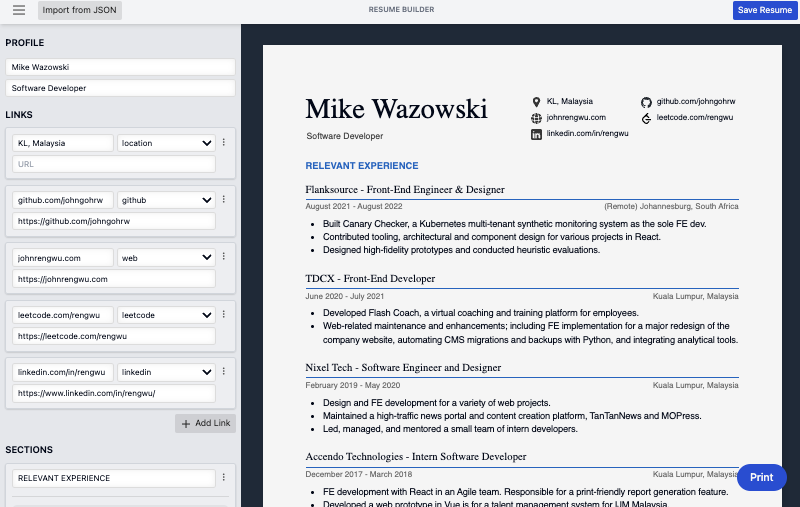

# cv-gen - a simple résumé builder & microsite

A customizable, print-friendly, yet simple resume-builder and microsite that lets you keep your own data.



[Visit site](https://cv-gen-app.netlify.app/) | [Resume builder](https://cv-gen-app.netlify.app/builder)

# How to use

Start by building your resume with the builder. Save your resume in JSON format and host it somewhere (Github or jsonbin.io).

Place the URL leading to your JSON file into the loader to view it in a print-friendly website. You can then freely share the link for others to see.

Alternatively, you can provide your JSON file as a URL parameter (`?data=`), and it will be viewed immediately upon visit:

```
https://cv-gen-app.netlify.app/?data=https://link.to/your/resume/data.json
```

## Getting started

### Starting development instance

```
npm install
npm run dev
```

### Building

Builds to `./build` folder

```
npm run build
```

## Hosting your microsite

You can easily deploy your own resume microsite with a couple of methods:

### 1. Netlify

Deploy this Git repository to your own Netlify site. You can configure it to automatically load a particular resume JSON URL upon visit using the following environment variables:

```
PUBLIC_PRELOADED_RESUME_DATA_URL="https://link.to/your/resume/export.json"
```

[](https://app.netlify.com/start/deploy?repository=https://github.com/johngohrw/cv-gen)

### 2. Manual self-hosting

First, create a file called `.env` in the root directory. Populate it with your resume's JSON export URL:

```
PUBLIC_PRELOADED_RESUME_DATA_URL="https://link.to/your/resume/export.json"
```

This ensures that the site will automatically load the given URL upon visiting.

After installing dependencies with `npm install`, run the build script with `npm run build` and a `./build` folder will be generated, ready to be statically-served with a HTTP server.
